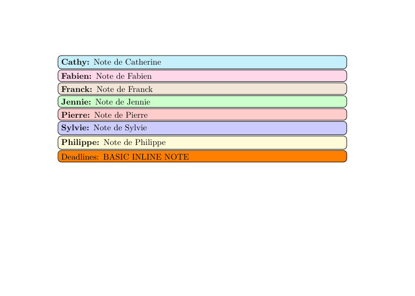

# Example of use of the `todonotes` package for collaboration

```latex
\documentclass{article}
\usepackage[utf8]{inputenc}
\usepackage[english]{babel}

% Necessary packages for this example
\usepackage{color}
\usepackage{xcolor}
\usepackage{todonotes}

% Each author gets their own note block macro
\newcommand{\pma}[1]{\todo[inline,color=red!20!white]{\textbf{Pierre:} #1}}
% We add another macro to color section of text of interest for the other authors
\newcommand{\pmat}[1]{{\color{red!85!black}#1}}

\newcommand{\ja}[1]{\todo[inline,color=green!20!white]{\textbf{Jennie:} #1}}
\newcommand{\jat}[1]{{\color{green!85!black}#1}}
\newcommand{\syc}[1]{\todo[inline,color=blue!20!white]{\textbf{Sylvie:} #1}}
\newcommand{\syct}[1]{{\color{blue!85!black}#1}}
\newcommand{\cf}[1]{\todo[inline,color=cyan!20!white]{\textbf{Cathy:} #1}}
\newcommand{\cft}[1]{{\color{cyan!85!black}#1}}
\newcommand{\fg}[1]{\todo[inline,color=magenta!20!white]{\textbf{Fabien:} #1}}
\newcommand{\fgt}[1]{{\color{magenta!80!white}#1}}
\newcommand{\pl}[1]{\todo[inline,color=yellow!20!white]{\textbf{Philippe:} #1}}
\newcommand{\plt}[1]{{\color{yellow!85!black}#1}}
\newcommand{\fm}[1]{\todo[inline,color=brown!20!white]{\textbf{Franck:} #1}}
\newcommand{\fmt}[1]{{\color{brown!60!black}#1}}

\begin{document}

\cf{Note de Catherine}
\fg{Note de Fabien}
\fm{Note de Franck}
\ja{Note de Jennie}
\pma{Note de Pierre}
\syc{Note de Sylvie}
\pl{Note de Philippe}

\todo[inline]{Deadlines:
BASIC INLINE NOTE
}

\end{document}
```

Creates the following pdf:

[](latex_todonotes_example.pdf)
